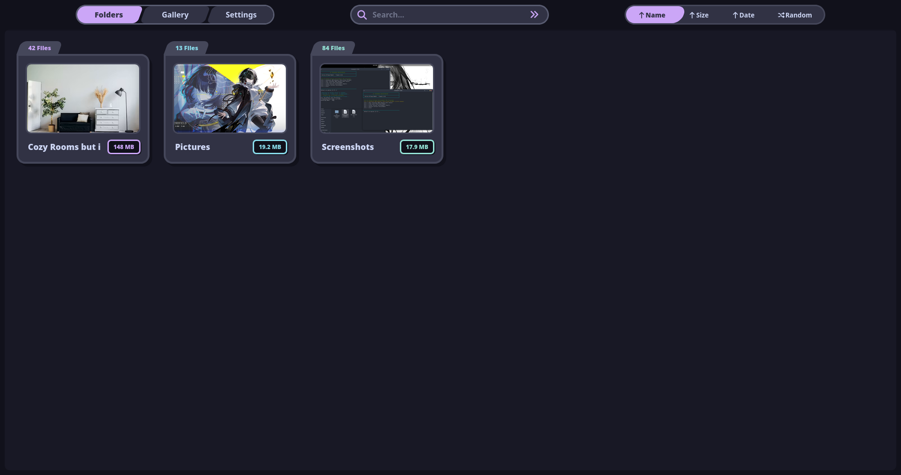
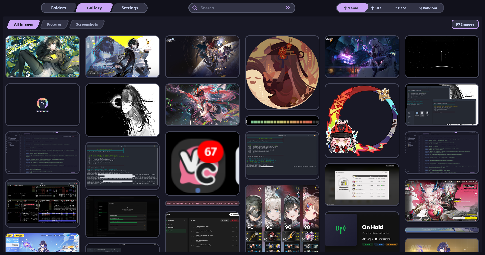
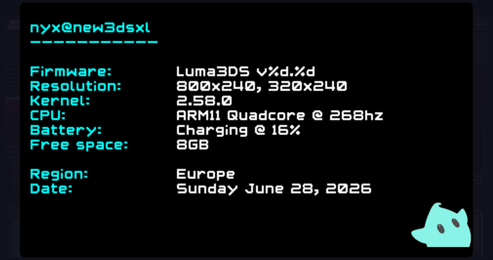

# ToDo:
- [ X ] Fix the sort icons that currently look off
- [ X ] Style the navigation pills so they do not look bland
- [ X ] Add a nice custom scrollbar to the website
- [ X ] Implement the Gallery and Settings tabs:
    - [ X ] Gallery tab
    - [ X ] Settings tab
- [ X ] Change the search icon color to a random accent color on hover
- [ X ] Add a file count badge to interactive elements:
    - [ X ] Make every single element on the site interactable
- [ X ] Set the image hover border color to match the color of its folder
- [ _ ] Add image controls:
    - [ _ ] Next and previous buttons
    - [ _ ] Slideshow mode (with milliseconds per image setting)
    - [ _ ] Copy image option
- [ _ ] Display a drawer when hovering over the bottom edge:
    - [ _ ] Slide up a small drawer with a right-to-left list of previous and next images
    - [ _ ] Allow the list to be scrolled or dragged
- [ _ ] Implement alternative navigation inputs:
    - [ _ ] Scroll on the image to go next or previous
    - [ _ ] Use the arrow keys to go next or previous
    - [ _ ] Tap the left or right edge of the screen to go next or previous
- [ _ ] Make server acccount for images removed/added after its start

# How To ???
- Put the **server.py** in the **root** images **folder** and run:
  - **python ./server.py**
- Refresh the website

# Preview:

