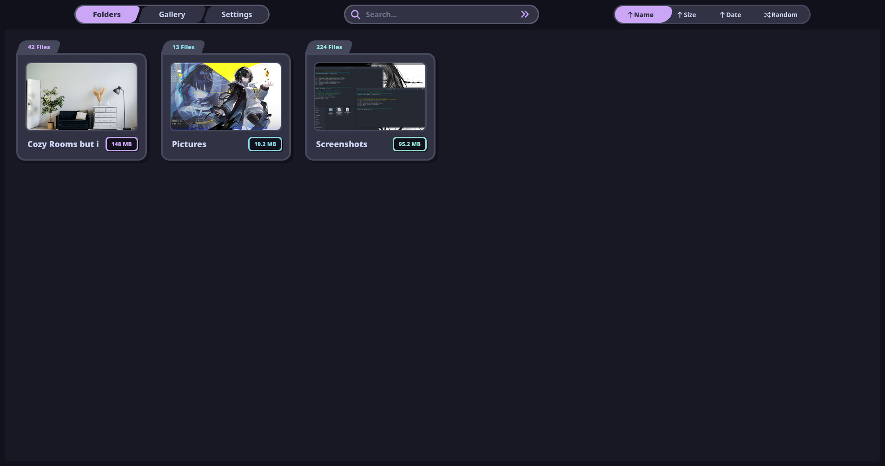
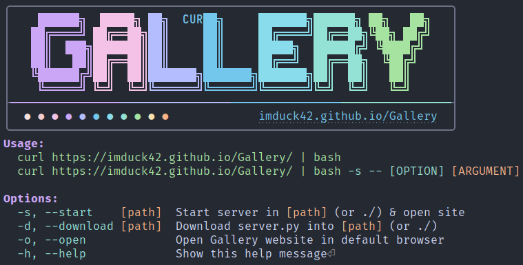
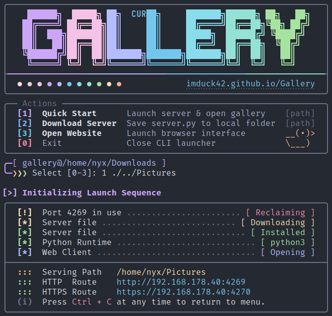

#  Gallery

## How To Use This Thing:
- Put the **server.py** in the **root** images **folder** and run:
  - **python server.py**
- Refresh the website, or open it

- **And if for whatever reason u wanna use da cli, feel free to:**
  - ```bash
    curl https://imduck42.github.io/Gallery/ | bash -s -- -h
    ```

## This Site Can Load Plugins, Cus Why Not
- Why should u use them?
    - You like running code u don't understand for sum extra features
    - You are me
    - Goon
- Why shouldn't u use them?
    - You like running code u don't understand for sum extra features

### If for some reason you want to use them:
1) **The easy part:** The sumtin.json settings page section addition
   - https://github.com/ImDuck42/Gallery/blob/main/assets/settings/settings.json

2) **The tedious part:** The sumtin.js file with the functionality of the plugin/extension/addon or whatever u wanna call it
   - https://github.com/ImDuck42/Gallery/blob/main/assets/settings/settings.js

- **Im too lazy so please consult Gemini 3.6 Fash for help with this:**
   - [Please, oh great Gemini, so help me in my endevour of understanding this oh so confusing stuff](https://aistudio.google.com/app/prompts?state=%7B%22ids%22:%5B%2219RFJ-b5T4ZhdxKar6TQa7vAFMacft3I_%22%5D,%22action%22:%22open%22,%22userId%22:%22106153650093848489488%22,%22resourceKeys%22:%7B%7D%7D&usp=sharing)


## ToDo:
- [ X ] Fix the sort icons that currently look off
- [ X ] Style the navigation pills so they do not look bland
- [ X ] Add a nice custom scrollbar to the website
- [ X ] Implement the Gallery and Settings tabs:
    - [ X ] Gallery tab
    - [ X ] Settings tab
- [ X ] Change the search icon color to a random accent color on hover
- [ X ] Add a file count badge to interactive elements:
    - [ X ] Make every single element on the site interactable
- [ X ] Set the image hover border color to match the color of its folder
- [ _ ] Allow removal of imported settings
- [ _ ] Add image controls:
    - [ _ ] Next and previous buttons
    - [ _ ] Slideshow mode (with milliseconds per image setting)
    - [ _ ] Copy image option
- [ _ ] Display a drawer when hovering over the bottom edge:
    - [ _ ] Slide up a small drawer with a right-to-left list of previous and next images
    - [ _ ] Allow the list to be scrolled or dragged
- [ _ ] Implement alternative navigation inputs:
    - [ _ ] Scroll on the image to go next or previous
    - [ _ ] Use the arrow keys to go next or previous
    - [ _ ] Tap the left or right edge of the screen to go next or previous
- [ _ ] Make server acccount for images removed/added after its start
- [ _ ] Make settings persist after page reloads


## Preview:




