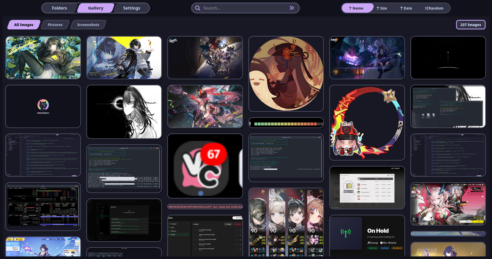
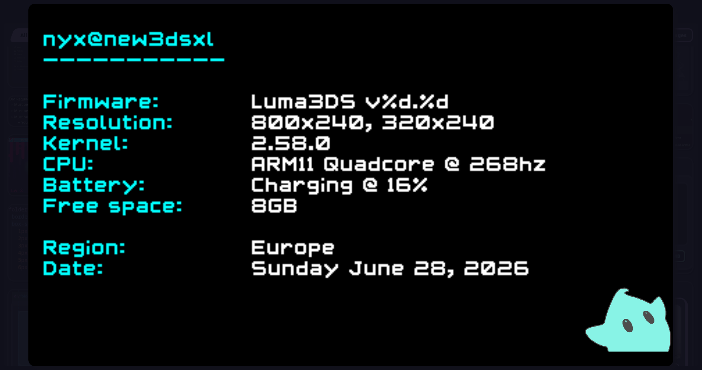
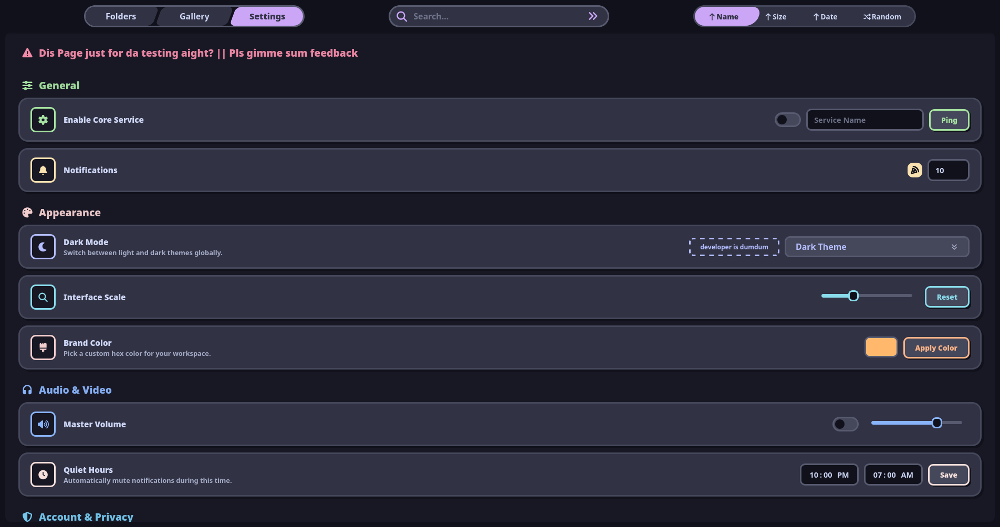
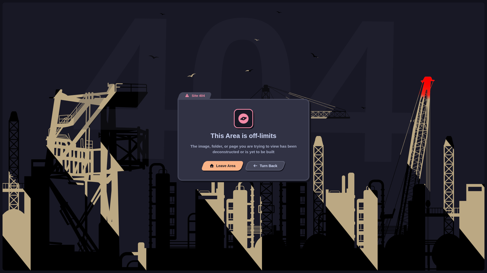
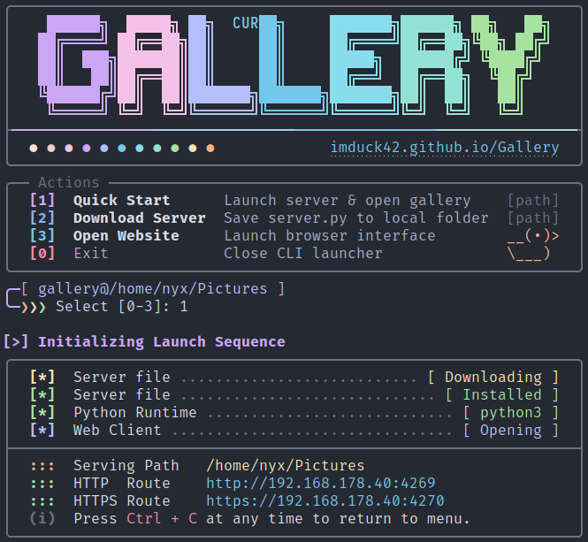

#  Gallery


## View the live Site:
| Version           | Site URL                                                          | Release Cycle    | Feel                      | Animal   | Recommended  |
| :---------------- | :---------------------------------------------------------------- | :--------------- | :------------------------ | :------  | :----------- |
| **Bleeding Edge** | [imduck42.github.io/Gallery](https://imduck42.github.io/Gallery/) | Rolling Release  | Latest features & changes | **Duck** | Not this one |
| **Stable-ish**    | [nyxie.nekoweb.org](https://nyxie.nekoweb.org/)                   | Batched releases | Polished* & fancy(URL)    | Cat      | **This one** |

*Applies 100% of the time unless you actually interact with it.

## Image Previews (GitHub):
<details>
  <summary>Click to expand</summary>

  > 
  > 
  > 
  > 
  > 
  > 
  > 
</details>

## How To Use This Thing:
- Put the **server.py** in the **root** images **folder** and run:
  - **python server.py**
- Refresh the website, or open it

- **And if for whatever reason u wanna use da cli, feel free to:**
  - ```bash
    curl https://imduck42.github.io/Gallery/ | bash
    ```
  - ```bash
    curl https://imduck42.github.io/Gallery/ | bash -s -- -h
    ```

## This Site Can Load Plugins, Cus Why Not
- Why should u use them?
    - You like running code u don't understand for sum extra features
    - You are me
    - Goon
- Why u shouldn't use them!
    - You like running code u don't understand for sum extra features

### If for some reason you want to use them:
1) **The easy part:** The sumtin.json settings page section addition
   - https://github.com/ImDuck42/Gallery/blob/main/assets/settings/settings.json

2) **The tedious part:** The sumtin.js file with the functionality of the plugin/extension/addon or whatever u wanna call it
   - https://github.com/ImDuck42/Gallery/blob/main/assets/settings/settings.js

## ToDo:
- [ X ] Fix the sort icons that currently look off
- [ X ] Style the navigation pills so they do not look bland
- [ X ] Add a nice custom scrollbar to the website
- [ X ] Implement the Gallery and Settings tabs:
    - [ X ] Gallery tab
    - [ X ] Settings tab
- [ X ] Change the search icon color to a random accent color on hover
- [ X ] Add a file count badge to interactive elements:
    - [ X ] Make every single element on the site interactable
- [ X ] Set the image hover border color to match the color of its folder
- [ X ] Allow removal of imported settings
    - [ _ ] Change it away from url guessing and direct to a sections header
- [ _ ] Add image controls:
    - [ _ ] Next and previous buttons
    - [ _ ] Slideshow mode (with milliseconds per image setting)
    - [ _ ] Copy image option
- [ _ ] Display a drawer when hovering over the bottom edge:
    - [ _ ] Slide up a small drawer with a right-to-left list of previous and next images
    - [ _ ] Allow the list to be scrolled or dragged
- [ _ ] Implement alternative navigation inputs:
    - [ _ ] Scroll on the image to go next or previous
    - [ _ ] Use the arrow keys to go next or previous
    - [ _ ] Tap the left or right edge of the screen to go next or previous
- [ X ] Make server acccount for images removed/added after its start
- [ X ] Make settings persist after page reloads

## License
This project is licensed under the **ImDuck42 License**. See the [LICENSE](LICENSE) file for details